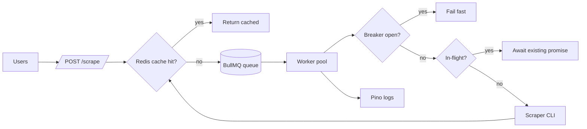

# Architecture

## Job flow: cron vs queue vs on-demand
- **On-demand (queue)**: user searches → enqueue → worker scrapes if cache miss
- **Nightly cron**: top ~500 queries × 6 retailers preloaded into cache before peak hours
- **Why both**: cron warms the cache for the long tail of common searches; queue handles cold queries without blocking the API thread

## Secret management
Env vars locally; in prod, AWS Secrets Manager or Doppler injected at container start. Proxy creds (Oxylabs etc.) never in code or logs.

## Logging + monitoring
Structured JSON logs via Pino → CloudWatch/Datadog. Key metrics: cache hit rate, p95 latency, jobs/sec per retailer, breaker state, scrape failure rate per retailer.

## Failure isolation
- One BullMQ queue per retailer → one bad retailer can't starve others
- Circuit breaker per retailer with 60s cooldown
- Dead-letter queue for jobs failing after 4 attempts → manual review